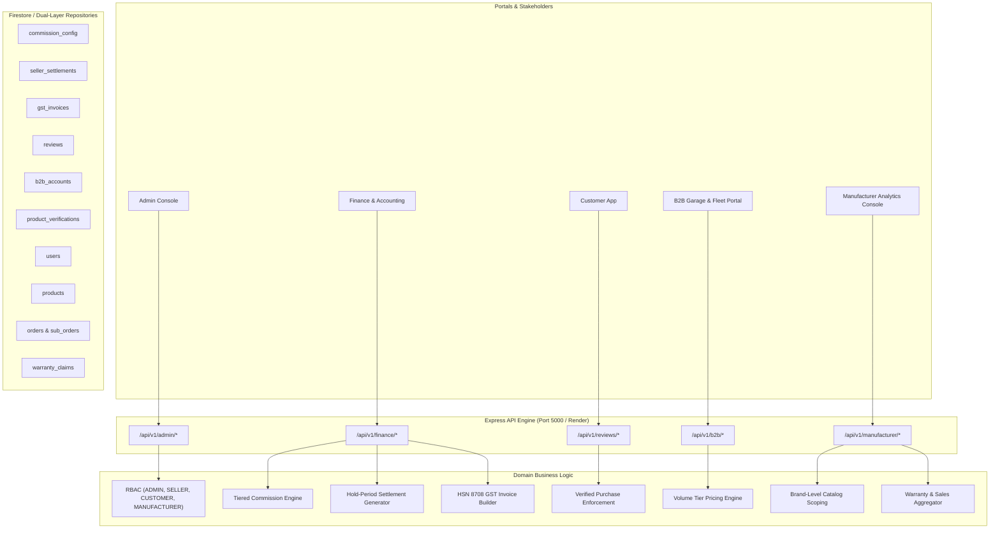
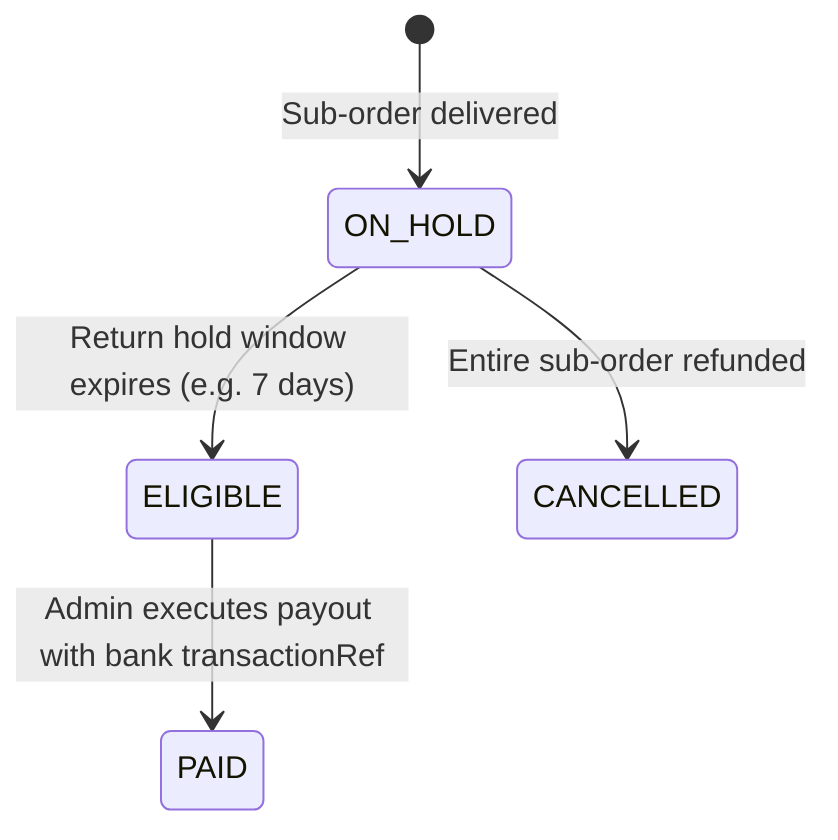

# Phase 6: Admin, Finance, Reviews, B2B & Manufacturer Documentation

AutoPartsHub / Vinimart Automobile Spare-Parts Marketplace Backend

---

## 1. Overview & Architecture

Phase 6 completes the marketplace operations matrix by introducing dedicated backend systems for Marketplace Administrators, Financial Settlements & GST Compliance, Moderated Customer Reviews, B2B Garage/Fleet Workflows, and Authorized Brand Manufacturers.

1. **Admin Backend (`/api/v1/admin`)**:
   - Centralized governance for Seller KYC verification, suspension, and reinstatement.
   - Comprehensive product review, categorization, and authenticity verification for genuine/OEM auto parts.
   - Omniscient order oversight hydrating parent and multi-vendor sub-orders.
   - Customer account security management without leaking credential hashes.
   - Moderation workflows for customer reviews and B2B business verifications.

2. **Finance & GST Compliance Engine (`/api/v1/finance`)**:
   - Tiered commission calculation engine (default rate, category overrides, and seller-negotiated rate overrides).
   - Authoritative seller settlement lifecycle respecting return hold windows (e.g. 7-14 days), net payout calculations deducting platform commissions and processed customer refunds.
   - Indian GST invoice breakdown engine supporting intra-state transactions (CGST 9% + SGST 9%) and inter-state transactions (IGST 18%) with statutory HSN code (8708) assignments.

3. **Customer Review System (`/api/v1/reviews`)**:
   - Verified Purchase requirement: Customers can only review products actually purchased in delivered orders.
   - Duplicate review prevention per customer per product.
   - Multi-dimensional rating (product, seller, delivery), photo/video attachment support, and admin moderation gating before public visibility.

4. **B2B Garage & Fleet Platform (`/api/v1/b2b`)**:
   - Business registration for garages, workshops, commercial transport fleets, and corporate accounts with GSTIN, PAN, and business license verification.
   - Dynamic tiered volume pricing models (e.g. 5–14 units: 5% discount, 15–49 units: 10% discount, 50+ units: 15% discount).
   - Bulk ordering workflows with atomic inventory reservations and instant repeat order replenishment.

5. **Manufacturer Portal & Analytics (`/api/v1/manufacturer`)**:
   - Brand-isolated catalog view for authorized OEM brand managers (e.g., Bosch, Valeo, Denso).
   - Aggregated telemetry for brand sales volume, authorized dealer distribution networks, and defect/warranty claim analytics.



---

## 2. Admin Module Specification

### Role-Based Access Control
All routes under `/api/v1/admin` require an authenticated session and the `ADMIN` role claim:
```typescript
adminRouter.use(requireAuthentication, requireRole('ADMIN'));
```
Non-admin tokens (e.g. `CUSTOMER` or `SELLER`) are rejected with `403 Forbidden`.

### Endpoints
- `GET /api/v1/admin/sellers`: Lists sellers with status and KYC verification filters.
- `POST /api/v1/admin/sellers/:sellerId/kyc`: Approves or rejects seller business credentials (GST, PAN, bank details).
- `PATCH /api/v1/admin/sellers/:sellerId/status`: Suspends, blocks, or reactivates seller accounts.
- `PUT /api/v1/admin/sellers/:sellerId/commission`: Configures seller-specific negotiated commission overrides.
- `GET /api/v1/admin/products`: Lists products across all sellers with status filters.
- `POST /api/v1/admin/products/:productId/review`: Approves or rejects catalog products.
- `POST /api/v1/admin/products/:productId/authenticity`: Verifies genuine/OEM authenticity based on brand authorization letters and invoices.
- `GET /api/v1/admin/orders`: Lists parent orders with hydrated multi-vendor sub-orders.
- `GET /api/v1/admin/customers`: Lists registered customers (masks password hashes and sensitive auth metadata).
- `PATCH /api/v1/admin/customers/:customerId/status`: Toggles customer account status (`ACTIVE`, `SUSPENDED`).
- `POST /api/v1/admin/reviews/:reviewId/moderate`: Approves or rejects customer product reviews.
- `POST /api/v1/admin/b2b/accounts/:accountId/verify`: Approves B2B garage/fleet business applications.

---

## 3. Finance & GST Compliance Specification

### Commission Calculation Hierarchy
When an order item is settled, the effective platform commission rate is calculated via a three-tier precedence:
1. **Seller-Negotiated Rate**: If an agreed rate exists for the specific seller, it takes highest precedence.
2. **Category Rate**: If a rate exists for the part category (e.g., *Braking System*: 8%, *Lighting*: 12%), it takes second precedence.
3. **Global Default Rate**: Falls back to the marketplace standard rate (10%).

### Settlement Lifecycle


- **Gross Amount**: Sub-order items total + applicable taxes.
- **Commission Amount**: `Math.round(GrossAmount * (CommissionRate / 100))`.
- **Refund Deductions**: Sum of all processed customer refunds attached to the sub-order.
- **Net Payout**: `Math.max(0, GrossAmount - CommissionAmount - RefundDeductions)`.

### GST Invoice Generation (HSN 8708)
Complies with the Indian Goods and Services Tax framework:
- **Intra-State**: When Seller State equals Delivery State (e.g., Delhi to Delhi), tax is split into **CGST (9%)** and **SGST (9%)**.
- **Inter-State**: When Seller State differs from Delivery State (e.g., Delhi to Maharashtra), tax is calculated as **IGST (18%)**.
- Standard automotive spare parts are tagged with HSN code `8708`.

---

## 4. Customer Reviews & Ratings Specification

- **Verified Purchase Enforcement**: The review service queries past orders for the customer; submission is strictly blocked with `403 VERIFIED_PURCHASE_REQUIRED` if no matching order is found.
- **Duplicate Prevention**: A customer can only submit one review per product; subsequent submissions are rejected with `400 REVIEW_ALREADY_EXISTS`.
- **Moderation Workflow**: Newly submitted reviews enter `PENDING` status and only become publicly visible via `GET /api/v1/reviews/products/:productId` after admin approval.

---

## 5. B2B Garage & Fleet Platform Specification

### Dynamic Tiered Pricing Model
Garages and commercial fleets purchasing in bulk receive automatic volume discount tiers:
- **1–4 units**: Standard Retail / Marketplace Price (0% discount).
- **5–14 units**: Workshop Tier (5% discount).
- **15–49 units**: Fleet Tier (10% discount).
- **50+ units**: Distributor Tier (15% discount).

### Bulk Ordering & Stock Validation
- Bulk orders validate stock across all requested items simultaneously.
- Atomic inventory decrements are executed across multiple vendor warehouses.
- Repeat orders allow garages to re-order standard inventory bundles with automated stock re-verification.

---

## 6. Manufacturer Operations & Brand Isolation

- **Brand Catalog Isolation**: When a manufacturer logs in, `GET /api/v1/manufacturer/catalog` strictly scopes the returned products to the manufacturer's `authorizedBrands` list.
- **Analytics Telemetry**: Aggregates total sales revenue, active authorized dealer counts, stock health, and warranty claim defects to detect manufacturing quality issues.

---

## 7. Verification & Test Suite Summary

The complete backend test suite runs 93 automated tests across 7 comprehensive test suites with zero failures:
```bash
npm test
```

### Test Suite Breakdown
| Phase | Scope | Test File | Tests Passed | Status |
| :--- | :--- | :--- | :--- | :--- |
| Phase 0 & 1 | Auth, Roles & Firebase Security | `test/auth.test.js` | 13 / 13 | PASS |
| Phase 2 | Database Schema, Categories & Fitment | `test/database.test.js` | 15 / 15 | PASS |
| Health | System Health & Observability | `test/health.test.js` | 6 / 6 | PASS |
| Phase 3 | Seller, Product & Inventory System | `test/seller_product_inventory.test.js` | 18 / 18 | PASS |
| Phase 4 | Customer Marketplace, Cart & Orders | `test/marketplace_cart_order.test.js` | 13 / 13 | PASS |
| Phase 5 | Payments, Shipping, Returns, Warranty | `test/payment_shipping_return_warranty.test.js` | 12 / 12 | PASS |
| Phase 6 | Admin, Finance, Reviews, B2B & Mfg | `test/admin_finance_reviews_b2b_mfg.test.js` | 16 / 16 | PASS |
| **Total** | **Full Marketplace Backend** | **All 7 Suites** | **93 / 93** | **100% PASS** |
