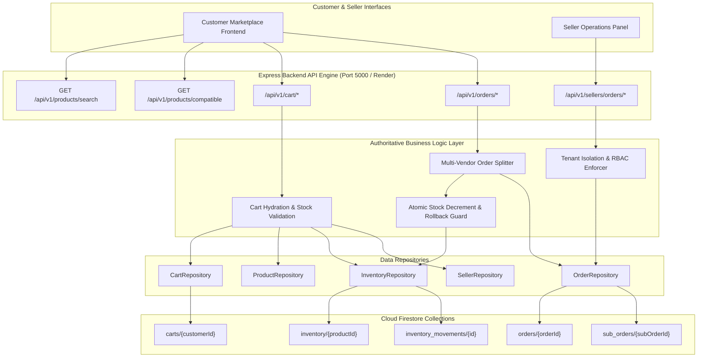
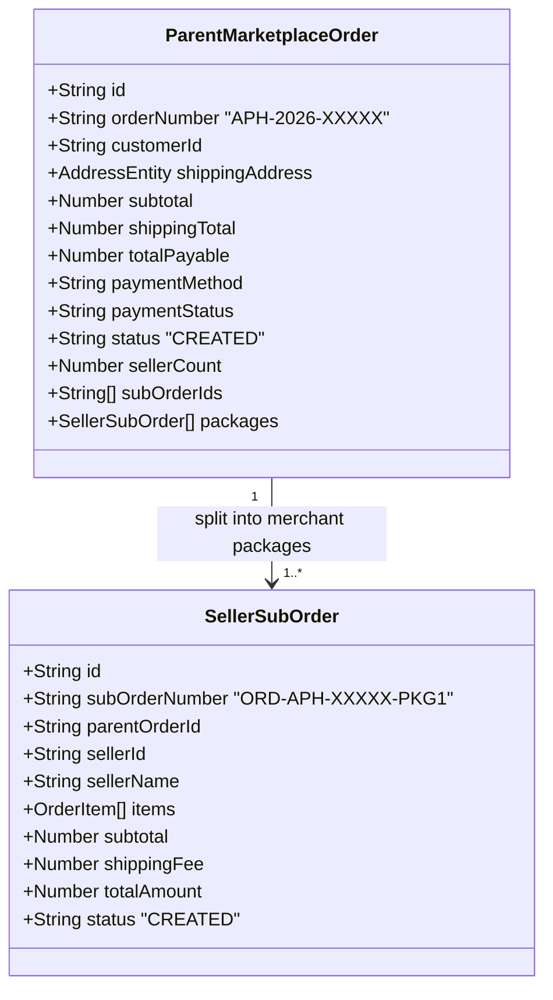

# Phase 4: Customer Marketplace + Cart + Multi-Vendor Order System Documentation

AutoPartsHub / Vinimart Automobile Spare-Parts Marketplace Backend

---

## 1. Overview & Architecture

Phase 4 bridges the customer frontend with the marketplace backend, powering the end-to-end purchasing lifecycle while preserving strict multi-vendor isolation. It handles multi-parameter catalog search, 7-tier vehicle fitment discovery, dynamic cart hydration with live inventory validation, and authoritative multi-vendor order checkout.



---

## 2. Customer Marketplace Discovery & Compatibility

### 2.1 Multi-Parameter Search (`GET /api/v1/products/search`)
- Supports fuzzy text search on `productName`, `partNumber`, `oemNumber`, `brand`, and `category`.
- Enforces active status filtering: only `APPROVED` listings are visible to public buyers.
- Enriches every matching product with an authoritative public seller card and stock availability summary.

### 2.2 7-Tier Vehicle Fitment Engine (`GET /api/v1/products/compatible`)
- Evaluates fitment against 7 hierarchy levels:
  `vehicleType` -> `manufacturerId` -> `modelId` -> `year` -> `fuelType` -> `engine` -> `variant`.
- Automatically incorporates universal fitment components (e.g. spark plugs, lubricants, cleaning chemicals) possessing token prefix `all:universal:universal` or `universal`.
- Prevents cross-vehicle mismatch by excluding parts engineered for other vehicle lines.

### 2.3 Public Seller Card Projection (Data Privacy Boundary)
When public catalog endpoints expose merchant data, all private KYC, GSTIN, PAN, bank account numbers, and internal audit notes are strictly stripped. Only public reputational attributes are returned:
```json
{
  "id": "seller_apex_auto_parts",
  "name": "Apex Brake Tech Solutions",
  "tier": "Wholesaler",
  "city": "New Delhi",
  "state": "Delhi",
  "rating": 4.8,
  "reviewCount": 120,
  "verified": true
}
```

---

## 3. Customer Cart System

### 3.1 Cart Hydration & Live Stock Verification
- Client inputs are never trusted for pricing or stock availability.
- The backend Cart Hydration Engine fetches the customer's raw cart items (`productId`, `quantity`) and dynamically resolves:
  1. Authoritative unit price and MRP from `ProductRepository`.
  2. Live available stock from `InventoryRepository`.
  3. Real-time availability flag (`isAvailable`) and warning messages (`Only X units remaining`).
  4. Automatic exclusion or flagging of deactivated/paused products.

### 3.2 Multi-Vendor Grouping
- Items in the cart are partitioned into `groups` by `sellerId`.
- Each seller group independently computes its subtotal and delivery logistics:
  - **Free Delivery**: Granted when seller group subtotal reaches $\ge ₹1500$.
  - **Standard Delivery**: ₹99 applied if seller group subtotal is $< ₹1500$.
- Aggregates cart totals:
  $$\text{Total Payable} = \sum \text{Seller Group Subtotals} + \sum \text{Seller Group Shipping Fees}$$

### 3.3 Cart Endpoints
| Method | Path | Auth | Description |
| :--- | :--- | :--- | :--- |
| `GET` | `/api/v1/cart` | Customer | Hydrates cart with live prices, stock, and seller groups |
| `POST` | `/api/v1/cart/items` | Customer | Adds an item with quantity bounds and stock verification |
| `PATCH` | `/api/v1/cart/items/:productId` | Customer | Updates item quantity (validates available inventory) |
| `DELETE` | `/api/v1/cart/items/:productId` | Customer | Removes an individual product from cart |
| `DELETE` | `/api/v1/cart` | Customer | Empties customer cart |

---

## 4. Multi-Vendor Order Engine & Sub-Order Splitting

### 4.1 Order Hierarchy
When a customer checks out a multi-vendor cart, the backend splits the transaction into two distinct tiers:



1. **Parent Marketplace Order (`APH-2026-XXXXX`)**:
   - Represents the complete multi-vendor order for the customer.
   - Contains customer shipping address, payment method, aggregated totals, and embedded package summaries.
2. **Seller Sub-Orders (`ORD-APH-XXXXX-PKG1`, `...-PKG2`)**:
   - Represents an isolated shipping package assigned exclusively to a specific merchant.
   - Contains only the items sold by that seller, merchant-specific subtotal, and seller fulfillment status.

### 4.2 Atomic Inventory Decrement & Rollback Guard
During checkout, stock is decremented sequentially for each cart item:
1. `inventoryRepository.adjustStock` is executed with movement type `SALE`.
2. If any item fails allocation due to concurrency or sudden depletion:
   - All previously decremented items in that cart are automatically restocked via `adjustStock` with type `RETURN_RESTOCK`.
   - The transaction is aborted with status 400 `INSUFFICIENT_STOCK`.
   - Cart contents and previous inventory balances remain completely intact.
3. Upon 100% successful inventory deduction, the customer's cart is automatically emptied.

---

## 5. Merchant Sub-Order Operations & Tenant Isolation

### 5.1 Seller Order Views (`GET /api/v1/sellers/orders`)
- Merchants can access only their own sub-orders (`sellerId == currentSeller.id`).
- Cross-tenant requests (Seller A attempting to view or alter Seller B's package) are rejected with `403 Forbidden`.

### 5.2 Package Lifecycle Updates (`PATCH /api/v1/sellers/orders/:subOrderId/status`)
- Sellers advance their package status through the order lifecycle:
  `CREATED` $\rightarrow$ `CONFIRMED` $\rightarrow$ `PROCESSING` $\rightarrow$ `COMPLETED` (or `CANCELLED`).
- Updates to a merchant sub-order do not compromise other merchants' packages within the same parent order.

---

## 6. Security Rules & Database Indexes

### 6.1 Firestore Security Rules (`firestore.rules`)
- `/carts/{customerId}`: Customers can only read and modify their own cart (`request.auth.uid == customerId`).
- `/orders/{orderId}`: Customers can only view their own parent orders (`request.auth.uid == resource.data.customerId`).
- `/sub_orders/{subOrderId}`: Restricted to the assigned seller (`request.auth.uid == resource.data.sellerId` or seller profile lookup) and admins.

### 6.2 Composite Indexes (`firestore.indexes.json`)
```json
[
  {
    "collectionGroup": "orders",
    "queryScope": "COLLECTION",
    "fields": [
      { "fieldPath": "customerId", "order": "ASCENDING" },
      { "fieldPath": "createdAt", "order": "DESCENDING" }
    ]
  },
  {
    "collectionGroup": "sub_orders",
    "queryScope": "COLLECTION",
    "fields": [
      { "fieldPath": "sellerId", "order": "ASCENDING" },
      { "fieldPath": "createdAt", "order": "DESCENDING" }
    ]
  },
  {
    "collectionGroup": "sub_orders",
    "queryScope": "COLLECTION",
    "fields": [
      { "fieldPath": "parentOrderId", "order": "ASCENDING" },
      { "fieldPath": "createdAt", "order": "ASCENDING" }
    ]
  }
]
```

---

## 7. Verification & Automated Test Matrix

All 10 integration test scenarios in `backend/test/marketplace_cart_order.test.js` pass with 0 failures:

| Test ID | Test Scenario | Expected Outcome | Result |
| :--- | :--- | :--- | :--- |
| **Test 1** | Marketplace Search by Keyword & Category | Returns matching products with safe public seller cards | **PASS** |
| **Test 2** | 7-Tier Vehicle Fitment Discovery | Returns exact fitment + universal parts; excludes non-matching | **PASS** |
| **Test 3** | Public Product Detail Endpoint | Returns live stock and sanitized public seller details | **PASS** |
| **Test 4** | Cart Add, Quantity Update & Multi-Vendor Grouping | Partitions items by seller; computes subtotal & free shipping | **PASS** |
| **Test 5** | Cart Rejects Excessive Quantity | Rejects addition exceeding live stock with 400 `INSUFFICIENT_STOCK` | **PASS** |
| **Test 6** | Cart Item Removal & Clear Cart | Removes item and clears cart cleanly | **PASS** |
| **Test 7** | Multi-Vendor Checkout & Sub-Order Splitting | Generates 1 Parent Order + 2 Seller Sub-Orders; decrements stock | **PASS** |
| **Test 8** | Atomic Rollback on Depleted Stock | Reverts prior decrements if subsequent item fails | **PASS** |
| **Test 9** | Customer Order Isolation | Prevents cross-customer order inspection (403 Forbidden) | **PASS** |
| **Test 10** | Seller Sub-Order Tenant Isolation | Seller A cannot view or update Seller B sub-orders (403 Forbidden) | **PASS** |

**Global Test Suite Status**:
59 tests across 5 test suites. **59 Passed, 0 Failed, 0 Skipped.**
Frontend Build (`tsc -b && vite build`): **0 Errors, Exit Code 0.**
