# Phase 7: Notifications & Support Ticketing System Documentation

AutoPartsHub / Vinimart Automobile Spare-Parts Marketplace Backend

---

## 1. Overview & Architecture

Phase 7 finalizes the customer experience and operational support loops by delivering:
1. **Omnichannel Notification Engine (`/api/v1/notifications`)**:
   - Multi-channel delivery across `IN_APP`, `EMAIL`, `SMS`, and `WHATSAPP`.
   - Event-driven notifications covering every marketplace milestone: New Orders, Order Confirmation, Order Status Changes, Shipment & Out-for-Delivery Updates, Return Status, Refund Confirmations, Warranty Claim Status, Seller KYC Approval/Rejection, Product Catalog Approvals, Low Stock Alerts, and Seller Payout Settlement Notices.
   - User notification preference management allowing customers and sellers to configure channel opt-ins (email, SMS, WhatsApp).
   - In-app notification center with unread count tracking, pagination, single-read, and mark-all-as-read endpoints.

2. **Customer Support Ticketing System (`/api/v1/support`)**:
   - Structured support tickets categorized by `ORDER`, `PRODUCT`, `PAYMENT`, `RETURN`, `WARRANTY`, `ACCOUNT`, or `GENERAL`.
   - Priority classification (`LOW`, `MEDIUM`, `HIGH`, `URGENT`) and lifecycle states (`OPEN`, `IN_PROGRESS`, `WAITING_FOR_CUSTOMER`, `RESOLVED`, `CLOSED`).
   - Threaded conversation messages with sender attribution (`CUSTOMER`, `AGENT`, `SYSTEM`).
   - Support for secure Firebase Storage file attachments (images, PDF invoices, diagnostic photos).
   - Admin management workflows: Ticket queue listing, agent assignment, status transitions, and resolution logging.

```mermaid
flowchart TD
    subgraph Triggers["Marketplace Event Triggers"]
        ORD["Order / Payment Events"]
        LOG["Logistics & Delivery Events"]
        RET["Return / Warranty Events"]
        KYC["Seller / Product KYC Events"]
        FIN["Finance Settlement Events"]
    end

    subgraph NotifEngine["Notification Dispatch Service"]
        PREF_CHK{"User Channel Preferences Enabled?"}
        IN_APP_DISP["In-App Notification (Firestore)"]
        EMAIL_DISP["Email Gateway (SES / SendGrid Mock)"]
        SMS_DISP["SMS Gateway (Twilio / Gupshup Mock)"]
        WA_DISP["WhatsApp Business API Mock"]
    end

    subgraph SupportSystem["Support Ticketing Engine"]
        TKT_CRT["Create Ticket (Customer / Seller)"]
        TKT_MSG["Threaded Replies & Attachments"]
        ADM_ASSIGN["Admin Assignment & Escalation"]
        TKT_RES["Resolution & Status Transitions"]
    end

    Triggers --> NotifEngine
    NotifEngine --> PREF_CHK
    PREF_CHK -->|In-App| IN_APP_DISP
    PREF_CHK -->|Email Opt-in| EMAIL_DISP
    PREF_CHK -->|SMS Opt-in| SMS_DISP
    PREF_CHK -->|WhatsApp Opt-in| WA_DISP

    TKT_CRT --> SupportSystem
    TKT_MSG --> SupportSystem
    SupportSystem --> ADM_ASSIGN
    ADM_ASSIGN --> TKT_RES
```



---

## 2. Notification System

### 2.1 Supported Event Catalog

| Event Code | Target Role | Channels Triggered | Description |
|---|---|---|---|
| `ORDER_CONFIRMED` | `CUSTOMER` | `IN_APP`, `EMAIL`, `SMS`, `WHATSAPP` | Order placed and authorized successfully |
| `ORDER_STATUS_CHANGED` | `CUSTOMER` | `IN_APP`, `EMAIL` | Sub-order status transition (CONFIRMED, PROCESSING) |
| `SHIPMENT_DISPATCHED` | `CUSTOMER` | `IN_APP`, `EMAIL`, `SMS`, `WHATSAPP` | Courier picked up package with AWB number |
| `SHIPMENT_DELIVERED` | `CUSTOMER` | `IN_APP`, `EMAIL`, `SMS`, `WHATSAPP` | Courier confirmed delivery |
| `RETURN_STATUS_CHANGED`| `CUSTOMER` | `IN_APP`, `EMAIL` | Return request approved, in-transit, or inspected |
| `REFUND_PROCESSED` | `CUSTOMER` | `IN_APP`, `EMAIL`, `SMS` | Payment refund credited back to source |
| `WARRANTY_STATUS_CHANGED`| `CUSTOMER`| `IN_APP`, `EMAIL` | Warranty inspection, replacement or repair decision |
| `SELLER_KYC_VERIFIED` | `SELLER` | `IN_APP`, `EMAIL` | Seller account approved by admin |
| `PRODUCT_APPROVED` | `SELLER` | `IN_APP`, `EMAIL` | Product catalog item cleared for sale |
| `LOW_STOCK_ALERT` | `SELLER` | `IN_APP`, `EMAIL` | Inventory level fell below reorder threshold |
| `SETTLEMENT_PROCESSED` | `SELLER` | `IN_APP`, `EMAIL` | Platform payout credited to seller bank account |
| `B2B_ACCOUNT_VERIFIED` | `CUSTOMER` | `IN_APP`, `EMAIL` | Garage/fleet trade license approved |

### 2.2 User Notification Preferences
Users can manage their channel delivery preferences stored in `notification_preferences/{userId}`:
```json
{
  "userId": "p7_cust01",
  "emailEnabled": true,
  "smsEnabled": false,
  "whatsappEnabled": true,
  "inAppEnabled": true
}
```
If a user disables `smsEnabled`, notifications targeting `SMS` are automatically skipped while `IN_APP` and `EMAIL` continue delivering.

---

## 3. Support Ticketing System

### 3.1 Ticket Lifecycle
1. **Creation (`POST /api/v1/support/tickets`)**:
   - Customer or seller creates a ticket with `subject`, `category`, `priority`, and `message`.
   - Optionally links `orderId`, `subOrderId`, `productId`, or `returnId`.
2. **Conversation Threading (`POST /api/v1/support/tickets/:ticketId/messages`)**:
   - Customer or support agent appends replies.
   - Attachments stored securely under Firebase Storage path `support/{userId}/{ticketId}/*`.
3. **Agent Assignment (`PATCH /api/v1/support/tickets/:ticketId/assign`)**:
   - Support admin assigns ticket to an active agent.
4. **Resolution (`PATCH /api/v1/support/tickets/:ticketId/status`)**:
   - Ticket transitioned to `RESOLVED` or `CLOSED` with resolution summary notes.

---

## 4. API Endpoints

### 4.1 Notification Endpoints (`/api/v1/notifications`)

| Method | Path | Auth | Description |
|---|---|---|---|
| `GET` | `/` | User | List user's notifications (paginated, unread filter) |
| `GET` | `/unread-count` | User | Returns count of unread notifications |
| `PATCH`| `/:id/read` | User | Marks a single notification as read |
| `POST`| `/mark-all-read` | User | Marks all notifications as read for calling user |
| `GET` | `/preferences` | User | Get user's notification preferences |
| `PUT` | `/preferences` | User | Update user's channel opt-ins |
| `POST`| `/send` | Admin | Manually broadcast/dispatch notification event |

### 4.2 Support Ticket Endpoints (`/api/v1/support`)

| Method | Path | Auth | Description |
|---|---|---|---|
| `POST` | `/tickets` | User | Create a new support ticket |
| `GET` | `/tickets` | User/Admin | List user's tickets (or all tickets for Admin) |
| `GET` | `/tickets/:ticketId` | User/Admin | Get ticket details and conversation thread |
| `POST` | `/tickets/:ticketId/messages` | User/Admin | Reply to ticket thread with optional attachments |
| `PATCH`| `/tickets/:ticketId/status` | User/Admin | Update ticket status (`OPEN`, `RESOLVED`, `CLOSED`) |
| `PATCH`| `/tickets/:ticketId/assign` | Admin | Assign ticket to support admin |

---

## 5. Security & Multi-Tenant Isolation

1. **Notification Ownership**: Users cannot access, view, or mark as read any notification where `recipientId !== req.user.uid`. Attempted cross-tenant access returns `403 FORBIDDEN`.
2. **Support Ticket Boundary**: Customers can only view and reply to tickets where `userId === req.user.uid`. Attempted inspection by another customer returns `403 FORBIDDEN`.
3. **Admin Exemption**: Platform administrators (`role === 'ADMIN'`) have omniscient access to read, assign, and reply to any ticket across the marketplace.
