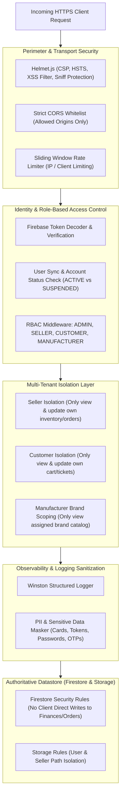

# Phase 7: Security Hardening & Production Protection Documentation

AutoPartsHub / Vinimart Automobile Spare-Parts Marketplace Backend

---

## 1. Overview & Security Architecture

Phase 7 hardens the AutoPartsHub backend for secure production deployment on Render with Firebase as the managed database and identity platform. The architecture applies **defense-in-depth**:



---

## 2. Security Controls & Implementations

### 2.1 Sliding Window Rate Limiting (`src/middlewares/rateLimiter.ts`)
- Implements an IP-based sliding window rate limiter.
- Default limit: 120 requests per minute per IP address.
- When the threshold is exceeded, requests are immediately halted with `429 TOO_MANY_REQUESTS` and standard `Retry-After` headers.
- Test bypass header `x-test-rate-limit` enables targeted unit verification without false positives in CI/CD.

### 2.2 Sensitive Data Scrubbing in Logs (`src/utils/logger.ts`)
- All incoming requests, headers, and outgoing log metadata pass through the recursive `sanitizeMeta()` scrubber.
- Automatically redacts:
  - `authorization` headers
  - `password`, `confirmPassword`, `newPassword`
  - `token`, `refreshToken`, `accessToken`, `idToken`
  - `creditCard`, `cardNumber`, `cvv`, `cvv2`, `expiry`
  - `otp`, `pin`, `pinCode` (in auth contexts), `secretKey`
- Replaces values with `[REDACTED]`, ensuring PCI-DSS and privacy compliance in logs stored on Render or external aggregators (Datadog/CloudWatch).

### 2.3 Strict Multi-Tenant Data Isolation
- **Sellers**:
  - A seller cannot modify another seller's products (`403 FORBIDDEN`).
  - A seller cannot adjust another seller's inventory or view competing sales figures.
  - Sub-order shipment generation strictly validates that the sub-order belongs to the authenticated seller.
- **Customers**:
  - Customers cannot inspect or reply to support tickets filed by other users (`403 FORBIDDEN`).
  - Customers cannot access notifications addressed to other user IDs.
  - Orders and cart checkouts are bound to the authenticated `req.user.uid`.
- **Manufacturers**:
  - Brand managers are strictly bound to their assigned brand name (`req.user.brandName` / `req.user.manufacturerBrand`).
  - Catalog queries and telemetry analytics automatically scope to only products matching the authorized brand.
- **Admins**:
  - Global administrative endpoints (`/api/v1/admin/*`) require explicit `role === 'ADMIN'`.

### 2.4 Error Masking & Exception Safety
- Uncaught exceptions and internal errors return generic, sanitized responses in non-test environments:
  ```json
  {
    "success": false,
    "code": "INTERNAL_SERVER_ERROR",
    "message": "An unexpected error occurred. Please contact support.",
    "requestId": "uuid"
  }
  ```
- Stack traces, database connection strings, and system file paths are completely stripped from API responses to prevent reconnaissance attacks.

---

## 3. Firebase Rules Finalization

### 3.1 Firestore Security Rules (`firestore.rules`)
- **Users**: Users can read/write their own profile (`request.auth.uid == userId`); Admins can read all.
- **Products**: Public read for approved products; Sellers write only their own products; Admins moderate all.
- **Orders & Payments**: Server-authoritative backend writes. Direct client modifications to order statuses, payment results, or settlement amounts are strictly blocked (`allow write: if false`).
- **Support Tickets**: Users can create and read their own tickets (`request.auth.uid == resource.data.userId`); Support Admins have full access.
- **Notifications**: Users can read and update (mark read) only their own notifications (`request.auth.uid == resource.data.recipientId`).

### 3.2 Firebase Storage Rules (`storage.rules`)
- **Seller KYC**: `sellers/{sellerId}/kyc/{fileName}` readable by seller and admin; writable only by the authenticated seller.
- **Product Images**: `sellers/{sellerId}/products/{fileName}` public read; writable only by the owning seller.
- **Support Attachments**: `support/{userId}/**` accessible only by the owning user and support admins; size capped at 10MB; validated image or PDF MIME types.

---

## 4. Production Environment Validation

Before launching to production:
1. Set `NODE_ENV=production`.
2. Configure `CORS_ORIGIN` with the exact frontend production domains (no wildcard `*`).
3. Provide production Firebase Service Account credentials via `FIREBASE_SERVICE_ACCOUNT_KEY` environment variable.
4. Provide production Razorpay/PayU keys and logistics webhook secrets.
