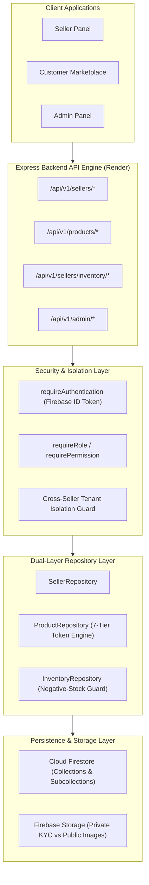
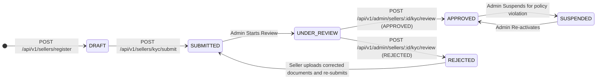

# Phase 3: Seller + Product + Inventory System Documentation

AutoPartsHub / Vinimart Automobile Spare-Parts Marketplace Backend

---

## 1. Overview & Architecture

Phase 3 builds the core merchant, catalog, and inventory foundation for the multi-vendor automotive spare parts marketplace. It establishes strict server-side authorization boundaries, Indian regulatory validations, 7-tier vehicle fitment indexing, and an immutable inventory movement ledger.



---

## 2. Seller Registration & KYC Workflow

### 2.1 Seller Types Supported
- **Manufacturer**: Direct automotive component maker (e.g., Bosch, Valeo, Tata OEM).
- **Authorized Distributor**: Tier-1 brand-authorized parts distributor.
- **Wholesaler**: Regional bulk spare parts supplier.
- **Retailer**: Local parts retailer/merchant.

### 2.2 KYC Lifecycle State Machine



### 2.3 Indian Regulatory Validation Rules
- **GSTIN**: Standard 15-character format matching `^[0-9]{2}[A-Z]{5}[0-9]{4}[A-Z]{1}[1-9A-Z]{1}Z[0-9A-Z]{1}$`.
- **PAN**: 10-character alphanumeric `^[A-Z]{5}[0-9]{4}[A-Z]{1}$`.
- **Mobile**: 10-digit Indian mobile starting with 6, 7, 8, or 9.
- **PIN Code**: 6-digit Indian postal code starting with digits 1-9 (`^[1-9][0-9]{5}$`).
- **IFSC Code**: 11-character Indian banking format (`^[A-Z]{4}0[A-Z0-9]{6}$`).

---

## 3. Product System & 7-Tier Vehicle Compatibility

### 3.1 Initial Core Categories
1. **Brake**: Brake pads, brake shoes, disc rotors, calipers, master cylinders.
2. **Clutch**: Clutch sets, pressure plates, clutch discs, release bearings.
3. **Suspension**: Shock absorbers, struts, coil springs, lower control arms.
4. **Gearbox / Transmission**: Synchronizer rings, gears, shift forks, bearings.
5. **Differential / Axle**: Crown wheel & pinion, axle shafts, differential spiders.

### 3.2 7-Tier Vehicle Fitment Specification
Compatibility is modeled strictly across the 7-tier automotive hierarchy:
$$\text{Vehicle Type} \rightarrow \text{Manufacturer} \rightarrow \text{Model} \rightarrow \text{Year} \rightarrow \text{Fuel Type} \rightarrow \text{Engine} \rightarrow \text{Variant}$$

### 3.3 High-Throughput Compatibility Tokens
Instead of full-text matching, products compile deterministic compatibility tokens:
```
passenger:maruti-suzuki:maruti-swift:2022:petrol:1.2l-k12m:vxi
commercial:tata-cv:tata-ace:2022:diesel:700cc:standard
```
These tokens are indexed in Firestore with `array-contains`, enabling sub-millisecond query evaluation.

### 3.4 Authenticity & Brand Verification
- **Genuine / OEM**: If seller is not an authorized distributor/manufacturer for the declared brand, the product is placed in `PENDING_REVIEW` and requires platform admin verification before publication.
- **Aftermarket**: Standard quality-tested replacement parts.
- **Pricing Guard**: Enforces $\text{MRP} \ge \text{Selling Price}$. Selling price above MRP is rejected with `VALIDATION_ERROR`.

---

## 4. Seller Inventory Management & Auditable Ledger

### 4.1 Stock Balancing Formula
$$\text{Available Stock} = \text{Current Stock} - \text{Reserved Stock}$$

- **Negative Stock Prevention**: Adjustments where $\text{Current Stock} + \Delta < 0$ or $\text{Available Stock} + \Delta < 0$ are immediately rejected with HTTP 400 (`INVALID_STOCK_OPERATION`).
- **Automatic Status Transitions**:
  - Stock reaches $0 \implies$ Product marked `OUT_OF_STOCK`.
  - Stock replenished $> 0 \implies$ Product restored to `APPROVED`.

### 4.2 Immutable Inventory Movement Ledger
Every stock adjustment writes to `inventory_movements`:
- `movementId`: Unique UUID.
- `productId` & `sellerId`: Ownership references.
- `type`: `RESTOCK`, `ADJUSTMENT_ADD`, `ADJUSTMENT_SUBTRACT`, `RESERVATION`, `RELEASE`, `SALE`, `RETURN_RESTOCK`.
- `quantityChanged`, `balanceBefore`, `balanceAfter`.
- `reason`, `referenceId`, `performedBy`, `createdAt`.

---

## 5. Storage Architecture & Security Isolation

### 5.1 Storage Rules Matrix
| Path Pattern | Read Access | Write Access | Constraints |
| :--- | :--- | :--- | :--- |
| `sellers/{sellerId}/kyc/*` | Owner (`userId == sellerId`) & Admin | Owner & Admin | Max 10MB, PDF/JPEG/PNG/WebP |
| `sellers/{sellerId}/auth/*` | Owner & Admin | Owner & Admin | Max 10MB, PDF/JPEG/PNG/WebP |
| `products/{sellerId}/*` | **Public** | Authenticated Owner & Admin | Max 5MB, JPEG/PNG/WebP/AVIF |

---

## 6. Complete API Reference

### 6.1 Seller Management (`/api/v1/sellers`)
- `POST /register` — Register as new seller (creates DRAFT profile, promotes user to SELLER role).
- `GET /profile` (or `/me`) — Retrieve authenticated seller's profile.
- `PATCH /profile` — Update business profile details (address, phone, contact).
- `POST /kyc/documents` — Attach KYC document metadata.
- `POST /kyc/submit` — Submit completed KYC for admin review.
- `GET /dashboard/metrics` — Aggregate metrics: total, active, pending, out-of-stock products, warehouse units, and inventory valuation.
- `POST /storage/policy` — Generate secure, isolated storage path metadata.

### 6.2 Seller Products (`/api/v1/sellers/products`)
- `POST /` — Create new spare part product with 7-tier compatibility and initial inventory.
- `GET /` — List seller's own products (filters: `status`, `category`, `search`, pagination).
- `GET /:id` — Retrieve seller product (enforces multi-tenant isolation).
- `PATCH /:id` — Update product details (re-computes compatibility tokens and discount).
- `DELETE /:id` — Archive product (soft delete).
- `PATCH /:id/status` — Toggle product status between `APPROVED` and `PAUSED`.

### 6.3 Public Products Catalog (`/api/v1/products`)
- `GET /` — Browse active marketplace catalog (`APPROVED` products only).
- `GET /:id` — Retrieve product details.
- `POST /:id/check-fitment` — Verify compatibility against 7-tier vehicle specification.

### 6.4 Seller Inventory (`/api/v1/sellers/inventory`)
- `GET /` — List inventory items enriched with product title, category, and pricing.
- `GET /:productId` — Single product inventory with recent audit movement history.
- `POST /:productId/adjust` — Atomic stock adjustment with negative-stock prevention.

### 6.5 Admin Operations (`/api/v1/admin`)
- `GET /sellers` — List sellers with optional `kycStatus` filter.
- `POST /sellers/:sellerId/kyc/review` — Review seller KYC (`APPROVED` or `REJECTED`).
- `GET /products` — List products pending approval.
- `POST /products/:productId/review` — Review product (`APPROVED` or `REJECTED`).
