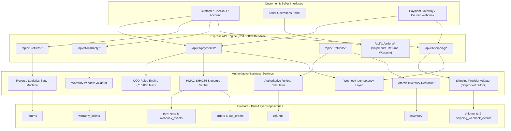

# Phase 5: Payment, Shipping, Returns, Refunds & Warranty Lifecycle Documentation

AutoPartsHub / Vinimart Automobile Spare-Parts Marketplace Backend

---

## 1. Overview & Architecture

Phase 5 extends the multi-vendor order architecture built in Phase 4 into a complete transactional and post-purchase lifecycle. It implements:

1. **Payment Gateway Integration & Verification**: Support for UPI, Credit/Debit Card, Net Banking, Digital Wallets, and Cash on Delivery (COD) with cryptographic HMAC-SHA256 signature verification and webhook idempotency.
2. **Shipping & Logistics Engine**: Provider-agnostic logistics abstraction (`IShippingProvider`, `ShippingProviderFactory`), AWB assignment, multi-checkpoint tracking history, and courier webhook synchronization.
3. **Returns Management with Wrong-Part Protection**: Structured return requests with mandatory vehicle fitment validation, photo evidence, seller review, and multi-stage reverse logistics tracking.
4. **Authoritative Refunds**: Server-enforced refund amounts preventing client-tampering, duplicate refund prevention, and automated inventory restock.
5. **Automobile Warranty Claims**: Time-window eligibility enforcement based on catalog warranty periods, photo/video diagnostic submission, and manufacturer/seller resolution outcomes (`REPLACEMENT`, `REFUND`, `REPAIR`, `REJECTED`).

---

## 2. API Contract & Endpoints

### 2.1 Payments API

| Method | Path | Auth | Description |
| :--- | :--- | :--- | :--- |
| `POST` | `/api/v1/payments/initiate` | Customer | Initiates payment for an order (`upi`, `card`, `netbanking`, `wallet`, `cod`). Returns provider order tokens. |
| `POST` | `/api/v1/payments/verify` | Customer | Server-side HMAC-SHA256 signature verification. Updates payment to `SUCCESS` and order to `PAID`. |
| `POST` | `/api/v1/payments/check-cod` | Public / Customer | Evaluates COD eligibility based on order value (<= ₹10,000) and delivery PIN code. |
| `GET` | `/api/v1/payments/order/:orderId` | Customer / Seller / Admin | Retrieves payment records associated with a specific order. |
| `POST` | `/api/v1/payments/webhook` | Gateway Signature | Idempotent webhook receiver for payment capture/failure events. Deduplicates via event ID. |

### 2.2 Shipping & Logistics API

| Method | Path | Auth | Description |
| :--- | :--- | :--- | :--- |
| `POST` | `/api/v1/shipping/shipments` | Seller | Dispatches an order package, allocates AWB, calculates estimated delivery, logs initial checkpoints. |
| `PATCH` | `/api/v1/shipping/shipments/:id/checkpoint` | Seller | Advances shipment checkpoint (`shipped`, `in_transit`, `out_for_delivery`, `delivered`). |
| `GET` | `/api/v1/shipping/track/:awbNumber` | Public | Customer-facing public shipment tracking by courier AWB number. |
| `GET` | `/api/v1/shipping/suborder/:subOrderId` | Seller / Customer | Fetches shipment details associated with a vendor sub-order. |
| `POST` | `/api/v1/shipping/webhook` | Courier / Public | Idempotent logistics webhook receiver updating tracking checkpoints. |

### 2.3 Returns Management API

| Method | Path | Auth | Description |
| :--- | :--- | :--- | :--- |
| `POST` | `/api/v1/returns` | Customer | Files return request with reason (`Defective`, `Damaged`, `Wrong Product`, `Not Compatible`), vehicle fitment proof, photos. |
| `GET` | `/api/v1/returns/:id` | Customer / Seller | Retrieves detailed return record with history and status. |
| `GET` | `/api/v1/returns/customer` | Customer | Lists all return requests submitted by the authenticated customer. |
| `GET` | `/api/v1/sellers/returns` | Seller | Lists all return requests assigned to the authenticated seller. |
| `PATCH` | `/api/v1/sellers/returns/:id/review` | Seller | Reviews return request (`APPROVED` or `REJECTED`) with decision notes. |
| `PATCH` | `/api/v1/sellers/returns/:id/stage` | Seller | Advances reverse logistics stage (`PICKUP_SCHEDULED`, `IN_TRANSIT`, `INSPECTED`). |

### 2.4 Refunds API

| Method | Path | Auth | Description |
| :--- | :--- | :--- | :--- |
| `POST` | `/api/v1/refunds/process` | Seller / Admin | Authoritatively processes refund for approved return. Prevents duplicate refunds, restocks inventory. |
| `GET` | `/api/v1/refunds/return/:returnId` | Customer / Seller | Retrieves refund receipt for a specific return. |
| `GET` | `/api/v1/refunds/:id` | Customer / Seller | Retrieves specific refund record by refund ID. |

### 2.5 Warranty Claims API

| Method | Path | Auth | Description |
| :--- | :--- | :--- | :--- |
| `POST` | `/api/v1/warranty/claims` | Customer | Submits warranty claim. Validates claim falls within product warranty period (e.g. 12 Months). |
| `GET` | `/api/v1/warranty/claims/:id` | Customer / Seller | Retrieves detailed warranty claim with diagnostic media. |
| `GET` | `/api/v1/warranty/customer` | Customer | Lists all warranty claims submitted by the customer. |
| `GET` | `/api/v1/sellers/warranty` | Seller | Lists all warranty claims routed to the seller's products. |
| `PATCH` | `/api/v1/sellers/warranty/:id/review` | Seller | Evaluates warranty claim (`APPROVED`, `REJECTED`, `IN_REVIEW`). |
| `PATCH` | `/api/v1/sellers/warranty/:id/outcome` | Seller | Finalizes claim with outcome (`REPLACEMENT`, `REFUND`, `REPAIR`, `REJECTED`). |

---

## 3. Core Business Logic & Security Enforcements

### 3.1 Server-Side Payment Verification
- The frontend initiates a transaction via `POST /api/v1/payments/initiate`.
- Payment completion is **never** accepted based on client assertions.
- The client must pass `providerPaymentId` and `providerSignature` to `POST /api/v1/payments/verify`.
- The backend computes `HMAC-SHA256(providerOrderId + "|" + providerPaymentId, SECRET)` and compares it strictly against the received signature. Only matching signatures update payment to `SUCCESS` and order to `PAID`.

### 3.2 Cash on Delivery (COD) Rules Engine
- COD availability is evaluated server-side.
- Maximum order threshold: ₹10,000. Orders exceeding this limit are rejected with an explicit threshold notice.
- Address pin code validation ensures serviceable geographic zones.

### 3.3 Webhook Idempotency & Deduplication
- Both payment and shipping webhooks persist processed event identifiers in Firestore collections `webhook_events` and `shipping_webhook_events`.
- Incoming events check existing event records. Duplicates immediately return `{ handled: true, duplicate: true }` without executing side effects or mutating state.

### 3.4 Wrong-Part Return Protection
- Automotive parts frequently suffer fitment disputes. Customers filing returns for `"Not Compatible"` must provide confirmation and vehicle attributes (`vehicleType`, `manufacturer`, `model`, `year`).
- Returns must include at least one diagnostic/evidence photo URL.
- Customer explanations are strictly validated with a 10-character minimum to prevent spam or bogus return claims.

### 3.5 Authoritative Refund Calculation & Restock
- Refund amounts are authoritatively derived from the verified sub-order package:
  $$\text{Refund Amount} = \text{Unit Price} \times \text{Quantity} + \text{Allocated Tax}$$
- Client-supplied amounts are ignored.
- Duplicate refunds for the same return request are strictly rejected.
- Successful refund processing triggers automatic inventory restock (`availableStock += quantity`), restoring inventory balance.

### 3.6 Warranty Duration Validation
- Product warranty specifications (e.g., `"12 Months"`, `"2 Years"`, `"6 Months"`) are parsed dynamically.
- The backend checks the elapsed time between order creation and claim filing. Claims filed after expiration are rejected with `WARRANTY_EXPIRED`.

---

## 4. Multi-Tenant Isolation & Access Control

- **Seller Isolation**: Seller endpoints enforce strict tenant boundaries. A seller cannot dispatch, track, review returns, or process warranty claims belonging to another seller. Unauthorized attempts return `403 FORBIDDEN`.
- **Customer Isolation**: Customers can only file returns, submit warranty claims, or view payment/refund records for orders they own.

---

## 5. Security Rules (Firestore & Storage)

### Firestore Security Rules
Added fine-grained document access rules for:
- `/payments/{paymentId}`: Read by owner customer or admin; write only by backend.
- `/shipments/{shipmentId}`: Public read for AWB tracking; write only by backend.
- `/returns/{returnId}`: Read by owning customer, assigned seller, or admin; write only by backend.
- `/refunds/{refundId}`: Read by customer or seller; write only by backend.
- `/warranty_claims/{claimId}`: Read by owner customer or assigned seller; write only by backend.
- `/webhook_events/{eventId}`: Backend service access only.

### Storage Security Rules
Added secure, isolated upload paths for evidence media:
- `/returns/{uid}/{allPaths=**}`: Writable only by the authenticated customer uploading return evidence.
- `/warranty/{uid}/{allPaths=**}`: Writable only by the authenticated customer uploading warranty diagnosis photos and videos.

---

## 6. Verification & Test Suite Summary

The comprehensive automated test suite `backend/test/payment_shipping_return_warranty.test.js` covers 18 test cases across all transactional domains:

1. Payment initiation (`INITIATED` status and provider tokens).
2. Server-side payment verification (HMAC signature matching, status to `SUCCESS`, order to `PAID`).
3. Payment verification rejection on tampered digital signature.
4. Idempotent payment webhook deduplication.
5. COD rules engine ₹10,000 threshold enforcement.
6. Seller package dispatch, AWB generation, and initial checkpoints.
7. Courier checkpoint advancement (`shipped` -> `delivered`) and public AWB tracking.
8. Shipping webhook idempotent checkpoint recording.
9. Cross-seller shipment generation breach prevention (`403 FORBIDDEN`).
10. Wrong-part protection return filing with vehicle fitment retention.
11. Return validation: invalid reason and cross-customer breach prevention.
12. Seller return review and reverse logistics stage progression.
13. Authoritative refund execution, customer credit, and inventory restock.
14. Duplicate refund attempt prevention.
15. Valid warranty claim submission with diagnostic media.
16. Expired warranty claim rejection (`WARRANTY_EXPIRED`).
17. Seller warranty claim review and `REPLACEMENT` outcome resolution.
18. Multi-tenant isolation for returns and warranty claims across competing sellers.

**Test Results Across All Phases:**
- `Phase 0 & Health`: 7/7 tests passed.
- `Phase 1 Firebase Auth`: 14/14 tests passed.
- `Phase 2 Database`: 10/10 tests passed.
- `Phase 3 Seller + Catalog + Inventory`: 18/18 tests passed.
- `Phase 4 Customer Marketplace + Cart + Order`: 10/10 tests passed.
- `Phase 5 Payment + Shipping + Returns + Refunds + Warranty`: 18/18 tests passed.
- **Total Backend Suite**: **77/77 tests passed (0 failures)**.
- **Root Frontend Workspace**: `npm run build` compiled with **0 errors**.
